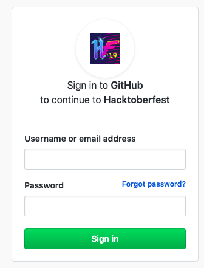
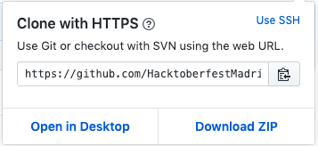

# Workshop HacktoberFest 2019

Bienvenidos al workshop del Hacktoberfest!

El fin de este repositorio es hacer nuestra primera contribución Open Source como parte del **HacktoberFest 2019**. Para ello queremos recopilar los `Hello World` de los lenguajes de programación más raros que podamos encontrar o si no os queréis complicar la vida se puede aportar el de vuestro lenguaje favorito, el nuestro es [Piet](http://homepages.vub.ac.be/~diddesen/piet/index.html) (o no).

Dejémonos de chachara y vamos con ello.


## 1. Git y Github

Lo primero que necesitamos es tener `git` instalado en nuestro ordenador, para ello podemos descargarlo desde [aquí](https://git-scm.com/downloads). Si no sabéis de que se trata, es un sistema de control de versiones diseñado por [Linus Torvalds](https://media.giphy.com/media/olAik8MhYOB9K/giphy.gif).


Por otro lado, si os fijáis, este repo se encuentra alojado en **Github**, de modo que para que las contribuciones cuenten de cara al evento, es necesario crear una cuenta, para ello nos dirijimos a la página [principal](https://github.com) y  pulsamos el botón *Sign in*, seguimos los pasos y ya tendremos nuestra cuenta creada.

## 2. Registrarse en el HacktoberFest 2019

El siguiente paso es registrarnos en el evento, para ello vamos a la [página oficial](https://hacktoberfest.digitalocean.com/). Una vez abierta, clicamos en el botón *START HACKING*


Nos redigirá a **Github** y nos pedira autenticarnos



Una vez autenticados, solo es necesario autorizar a Hacktoberfest (digitalocean)


Tras esto, volveremos a la página del Hacktoberfest y solo faltará logarse con la cuenta de Github


Rellenamos un pequeño *About you* en el que aceptaremos las reglas y valores (*Rules and Values*), venderemos nuestra alma y clicando en *Start Hacking* nos habremos registrado por completo en el evento.


## 3. Ya tengo Git, Github y estoy registrado en el evento ¿ahora qué?

El siguiente paso es hacer un *Fork* del repositorio, para ello solo tenemos que ir a la parte superior donde se encuentra el repo. Esto creará una copia del repositorio en el estado actual en la cuenta de Github con la que estemos logueados y nos permitirá hacer modificaciones sobre el mismo, para luego realizar la contribución mediante un *Pull Request*.


Cuando hagamos el *Fork* veremos como se ha creado un nuevo repositorio en nuestra cuenta de la siguiente forma: `[Usuario]/Hacktoberfest_MeetUp`

Si accedemos al repositorio podremos observar que aparece un botón en verde que pone *Clone or Download*, al clicar se mostrará un enlace que utilizaremos para clonar el repositorio, lo copiamos y aquí entrará nuesto coleguita **Git**.



Al copiar el enlace abriremos una terminal sobre la que escribiremos el siguiente comando

`git clone https://github.com/HacktoberfestMadrid/Hacktoberfest_MeetUp.git`

*Recordad que en lugar de aparecer Hacktoberfestmadrid, aparecerá vuestro usuario de github*

Entramos en la carpeta que se acaba de crear

`cd Hacktoberfest_MeetUp`

Voilá! Ahora todo el código del repo lo tenéis a vuestro alcance, pero aún falta algo más por hacer. Necesitamos crearnos una rama sobre la que trabajar, para ello ejecutamos lo siguiente

`git checkout -b feature/rama-con-un-nombre-hiper-molon`

Ya tendremos nuestra rama sobre la que trabajar y hacer nuestra contribución.

En resumen los pasos que hemos seguido son los siguientes:
1.  Hacemos un *Fork*
2.  Clonamos el repositorio a nuestro ordenador
3.  Creamos una rama sobre la que trabajar

Ya lo tenemos, ahora os explicaremos como contribuir.


## Cómo contribuir

Ahora viene lo divertido. 

Para contribuir intentemos buscar el lenguaje más raro (u odiado) que podamos imaginar y añadamos el `Hello World`, si no os queréis complicar la vida añade tu `Hello World` favorito y a correr, luego si te miramos mal, tu sabrás.


Por si acaso os dejamos algunos ejemplos:

* [Piet](http://homepages.vub.ac.be/~diddesen/piet/index.html)
* [brainfuck](https://esolangs.org/wiki/Brainfuck)
* [PostCSS Andalusian](https://github.com/bameda/postcss-andalusian-stylesheets)
* [Whitespace](https://es.wikipedia.org/wiki/Whitespace)
* [COBOL](https://es.wikipedia.org/wiki/COBOL)

En la rama que hemos creado, creamos una nueva carpeta con el nombre del lenguaje de preogramación y dentro generamos el fichero con el `Hello World`. Por si escogemos el mismo lenguaje, crearemos el fichero con la notación `[Usuario]_hello_world.[Ext.]`, así si varias personas deciden contribuir el mismo, no habrá problemas.

```
.
+-- python
|   +-- usuario1_hello_world.py
|   +-- usuario2_hello_world.py

```

Por otro lado, podremos añadirnos al fichero [Contributors](Contributors.md) y quedar ahí para la posteridad.

Para contribuir, una vez generado el fichero y cambiado el anterior hay que comitearlo, para ello ejecutamos

`git status`

Aquí se mostrará el nuevo fichero que no está siendo trackeado por **Git** y la modificación a Contributors, para que hagan efecto los cambios ejecutaremos

`git add python/usuario1_hello_world.py Contributors.md`

Ahora necesitamos guardar los cambios

`git commit -m "incluir python"`

El último paso antes de la *Pull Request* es llevar los cambios locales al repositorio de **Github** para ello hacemos lo siguiente

`git push origin feature/rama-con-un-nombre-hiper-molon`

Por fin! Es hora de la *Pull Request*


Para hacerla, iremos al repositorio de nuestra cuenta y veremos un icono indicando que hemos hecho cambios hace poco y podremos pulsar *Compare & pull request*


Al pulsar solo nos falta finalizarla clicando en *Create pull request*


Ahora, los mantenedores del repositorio revisarán los cambios y si todo está correcto mergearán la rama y habréis realizado una contribución a un proyecto Open Source, no os preocupéis que aceptamos todas.


!Hasta aquí todo! 

Muchas gracias a todos por pasaros y por estar aquí con nosotros, esperemos que esto os ayude a entender un poco más el mundo Open Source y animaros a contribuir en proyectos molones :D
